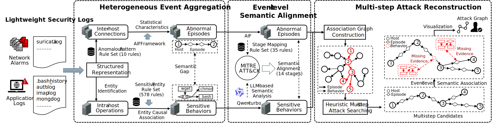

# MuSAR

**Link: https://github.com/zisenXu/MuSAR**

**MuSAR: Multi-Step Attack Reconstruction from Lightweight Security Logs via Event-Level Semantic Association in Multi-Host Environments**



In this paper, we present MuSAR, a framework for real-time reconstruction of multi-step attacks in multi-host environments using lightweight security logs (network alarms and application logs), leveraging the observation that such attacks typically exhibit hop-based patterns with evidence dispersed across semantically complementary log sources. MuSAR performs semantic analysis to create abstract representations, consolidating logs into security events that capture underlying attack activities. Through integration with the MITRE ATT\&CK framework, MuSAR maps heterogeneous events to attack stages, achieving semantic alignment within a unified attack lifecycle, and implements a heuristic algorithm to identify potential multi-step attacks and reconstruct complete attack sequences based on event-level semantic associations.

## Dependencies

The MuSAR framework has been validated on Ubuntu 20.04 with Python versions 3.8.20 and 3.10.15. The following components are required for deployment:

- Core dependencies: Install via `pip install -r requirements.txt`.
- [Graphviz](https://graphviz.org/): Visualization tool.
- MySQL: Required to run MuSAR, which can be deployed via `apt` on Ubuntu-based systems or `yum` on RHEL-based systems.
- Qwen-turbo: MuSAR defaults to using the [Qwen-turbo](https://www.aliyun.com/product/bailian) large language model API service through Alibaba Cloud's Bailian platform. However, other platforms can be integrated by modifying the prompt interface in `src/prompt.py`. To configure the API key for the service, add it to your environment variables. For example, include the following line in your `~/.bashrc` file:
```sh
echo "DASHSCOPE_API_KEY=you-api-key" >> ~/.bashrc
```

## Dataset

Our evaluation uses two distinct datasets: the public **CPTC2018** dataset and the **Multi-Step Attack Simulation (MSAS)** dataset collected in a controlled testbed with crafted vulnerabilities. 

We provide the preprocessed data in SQL format in the `preprocess_data` directory, which includes inter-host connections and intra-host operations from eight multi-step attack scenarios across both datasets. To deal with the preprocessed data, do as the follows:
- Extract all the `.gz` files using `gzip -d`
- Create a MySQL database using `CREATE DATABASE [your-database-name]`
- Import the preprocessed data in SQL format into the database by executing `mysql -u root -p [your-database-name] < xxx.sql` or `source xxx.sql`.

To pre-process these datasets from scratch, do as the follows:

- CPTC2018 dataset
  - **Download** and unzip the dataset from the public [website](https://mirror.rit.edu/cptc/). Five categories of representative lightweight security logs are `suricata_alert.json`, `bash_history.json`, `linux_secure.log/auth.log`, `imap_too_small.json`, and `mongodb.json`.
  - The **duration** of six scenarios (i.e., six teams) is nine hours, from 2018-11-03 13:30:00 to 23:00:00.
  - **Labeling**: Due to the lack of attack-related ground truth, we label network alarms where both the attacker and victim are Local Area Network (LAN) addresses (i.e., 10.0.\*.\*) and all historical command logs (i.e., `.bash_history`) as attack-related traces. These are presented in the "label" field in the preprocessed data.

- MSAS dataset
  - **Download** and unzip the dataset from [Google Drive](https://drive.google.com/file/d/1u3pptIsKUdaHuHl4S19uLRSUDD5dl5EE/view?usp=sharing). The `savestore.csv` file contains application logs exported from ElasticSearch, including `.bash_history` and `auth.log`. The raw traffic and audit logs from the involved hosts are stored in separate folders.
  - The **duration** of two scenarios is one hour: scenario S-1 spans from 2024-11-11 16:15:00 to 17:15:00, and scenario S-2 spans from 2024-11-11 17:30:00 to 18:30:00.
  - **Labeling**: The ground truth of the MSAS dataset is provided in "label" field in the preprocessed data. In addition, we provide a detailed breakdown of the attack steps and ground truth distribution for two attack scenarios from the MSAS dataset, as described in Appendix B of the paper.

We provide data parsing and preprocessing modules, which are organized into the following directories: `auth_parse`, `bash_parse`, `imap_parse`, and `mongo_parse`. If you prefer to read data from files rather than database, you can simply modify the existing data access interfaces.

### File Structure

The `src` directory contains the core modules of MuSAR. Below is a brief description of each file:

- **`DataLoader.py/DataSaver.py`**: Interfaces for loading and saving data to and from the MySQL database.
- **`FalseAlarmFilter.py`**: Given that the CPTC and MSAS datasets focus primarily on attack traffic, a whitelist is used to filter out irrelevant alerts. You can integrate your own false positive filtering methods here based on specific scenarios.
- **`EpisodeExtractor.py`**: Aggregates inter-host abnormal episodes, referencing the [SAGE](https://github.com/tudelft-cda-lab/SAGE).
- **`BehaviourExtractor.py`**: Aggregates intra-host sensitive behaviors.
- **`ChainSearcher.py`**: Heuristic search for multi-step attacks.
- **`ChainEvaluator.py`**: Evaluates the reconstruction of multi-step attacks.
- **`AttackGraphMaker.py`**: Generates and visualizes attack graphs.
- **`AttackStage.py`**: Maps rules between the AIF framework and the MITRE ATT&CK framework.
- **`prompt.py`**: Provides a prompt for determining the underlying attack stages of intra-host sensitive behaviors using Qwen-turbo model.

## Evaluation

This is a guildline on reproducing MuSAR's evaluations. 

### Database Configurations

Ensure that the database connection settings in `src/Config.py` are correctly configured. You will need to modify the following parameters:
- connect_host: Database host
- connect_port: Database port
- connect_user: Database user
- connect_password: Database password
- db_name: Name of your database

Additionally, you can evaluate different datasets by adjusting the MODE parameter.

Confirm that the `alert_table_name` and `host_log_table_name` variables in `main.py` match the table names in your MySQL database to ensure that data can be read correctly.


### Run MuSAR

By default, the `READ_BEHAVIOR_FROM_DATABASE` parameter in `src/Config.py` is set to `False`. This configuration ensures that intra-host sensitive behaviors identified by MuSAR are saved into the MySQL database. After the initial run, set  `READ_BEHAVIOR_FROM_DATABASE` to `True` for subsequent runs to directly retrieve this data from the database. This avoids the overhead of repeatedly invoking the large language model, improving efficiency.

Run `python main.py` to start the multi-step attack reconstruction and generate attack graphs:

By default, the time window for a single reconstruction is set to 1 hour, suitable for the CPTC2018 and MSAS datasets. A larger time window could cause multiple multi-step attacks to be merged, potentially compromising the accuracy of the analysis.

### Evaluate Your Dataset

MuSAR is easily adaptable to your dataset. To do so, follow these steps:

- Ensure your dataset follows MuSAR's structured representation of two types of log-level traces: inter-host connections and intra-host operations, with the relevant fields defined in `src/DataLoader.py`.
- Modify the `whiteList` parameter in `Config.py` or implement a custom false alarm filtering method in `src/FalseAlarmFilter.py` to remove irrelevant data based on your dataset's scenario.
- For inter-host connections, supplement the mapping rules between attack signatures and the AIF framework's stages in `src/AttackStage.py`. MuSAR can automatically correlate the AIF framework with the MITRE ATT&CK framework.

## Real-time Analysis System

We have developed an interactive real-time analysis system that incorporates MuSAR's core functionalities, showcasing its feasibility for deployment in production environments. The system can be accessed [here](https://bit.ly/4h11wwZ).

Additionally, we provide a supplementary demonstration video `assets/demo.mp4` that illustrates the system's operational workflow and key functionalities.

<video width="640" height="360" controls>
  <source src="assets/demo.mp4" type="video/mp4">
</video>

## 📚 Publication

Our work has been accepted at the **28th International Symposium on Research in Attacks, Intrusions and Defenses (RAID 2025)**. 

```
@INPROCEEDINGS{yang2025,
  author={Liu, Yang and Xu, Zisen and Luo, Zian and Shang, Jin’Ao and Zhang, Shilong and Zhang, Haichuan and Liu, Ting},
  booktitle={2025 28th International Symposium on Research in Attacks, Intrusions and Defenses (RAID)}, 
  title={MuSAR: Multi-Step Attack Reconstruction from Lightweight Security Logs via Event-Level Semantic Association in Multi-Host Environments}, 
  year={2025},
  volume={},
  number={},
  pages={329-348},
  keywords={Limiting;Heuristic algorithms;Semantics;Real-time systems;Security;Lightweight Security Logs;Semantic Alignment;Event-level Semantic Association;Attack Reconstruction},
  doi={10.1109/RAID67961.2025.00038}}
```

