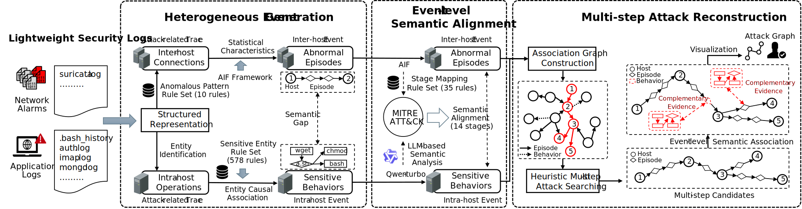

# MuSAR

**MuSAR: Multi-Step Attack Reconstruction from Lightweight Security Logs via Event-Level Semantic Association**



In this paper, we present MuSAR, a framework for real-time reconstruction of multi-step attacks in multi-host environments using lightweight security logs (network alarms and application logs), leveraging the observation that such attacks typically exhibit hop-based patterns with evidence dispersed across semantically complementary log sources. MuSAR performs semantic analysis to create abstract representations, consolidating logs into security events that capture underlying attack activities. Through integration with the MITRE ATT\&CK framework, MuSAR maps heterogeneous events to attack stages, achieving semantic alignment within a unified attack lifecycle, and implements a heuristic algorithm to identify potential multi-step attacks and reconstruct complete attack sequences based on event-level semantic associations.

## Dependencies

The MuSAR framework has been validated on Ubuntu 20.04 with Python versions 3.8.20 and 3.10.15. The following components are required for deployment:

- Core dependencies: `pip install -r requirements.txt`
- [Graphviz](https://graphviz.org/) visualization  tool
- A large language model API service (default: [Qwen-turbo](https://www.aliyun.com/product/bailian)  through Alibaba Cloud's Bailian platform, though other platforms can be integrated by modifying the prompt interface in `src/prompt.py`)
- MySQL 8, you can install via `apt install` on Ubuntu or `yum install` on CentOS
- MySQL is required to run MuSAR, which can be deployed via `apt` on Ubuntu-based systems or `yum` on RHEL-based systems

```sh
echo "DASHSCOPE_API_KEY=you-api-key" >> ~/.bashrc
```

## Dataset

Our evaluation leverages two distinct datasets: the public CPTC2018 dataset and a Multi-Step Attack Simulation (MSAS) dataset. We provide the preprocessed data in SQL format in the `preprocess_data` directory, including inter-host connections and intra-host operations from eight multi-step attack scenarios across two datasets . You need to extract all the `.gz` files, then create a database in MySQL, and import the preprocessed data into the database by executing `mysql -u root -p [your-database-name] < xxx.sql` or `source xxx.sql`.

To pre-process these datasets from scratch, do as the follows:

- CPTC2018 dataset
  - Download and unzip the dataset from the public [website](https://mirror.rit.edu/cptc/). Five categories of representative lightweight security logs are `suricata_alert.json`, `bash_history.json`, `linux_secure.log/auth.log`, `imap_too_small.json`, and `mongodb.json`.
  - The duration of six scenarios (i.e., teams) is 9 hours, from 2018-11-03 13:30:00 to 23:00:00.
  - Due to the lack of attack-related ground truth, we label network alarms where both the attacker and victim are Local Area Network (LAN) addresses (i.e., 10.0.\*.\*) and all historical command logs (i.e., .bash\_history) as attack-related traces, as shown in "label" field in the preprocessed data.

- MSAS dataset
  - Download and unzip the dataset from [Google Drive](https://drive.google.com/file/d/1u3pptIsKUdaHuHl4S19uLRSUDD5dl5EE/view?usp=sharing). The `savestore.csv` file contains application logs exported from ElasticSearch, including `.bash_history` and `auth.log`. The raw traffic and audit logs from the other five hosts are stored in separate folders.
  - The duration of two scenarios is 1 hours, with scenario 1 spanning from 2024-11-11 16:15:00 to 17:15:00 and scenario 1 spanning from 2024-11-11 17:30:00 to 18:30:00
  - The ground truth of the MSAS dataset is presented in "label" field in the preprocessed data. In addition, we provide a detailed breakdown of the attack steps and ground truth distribution for two attack scenarios from the MSAS dataset, as described in the appendix B of the paper.

The provided data parsing and preprocessing modules are mainly implemented with MySQL interfaces for data access and manipulation, organized into several directories: `auth_parse`, `bash_parse`, `imap_parse`, and `mongo_parse`. If you want to read from files instead, you just need to modify the I/O interfaces. 

### File Structure

The `src` directory contains the core modules of MuSAR. Below is a brief description of each file:

- **`DataLoader.py/DataSaver.py`**: Data interfaces for interacting with the MySQL database.
- **`FalseAlarmFilter.py`**: Since the CPTC and MSAS datasets focus primarily on attack traffic, a whitelist is used to filter out irrelevant alerts. You can integrate your own false positive filtering method here according to different scenarios.
- **`EpisodeExtractor.py`**: Aggregation of inter-host abnormal episodes, referencing [SAGE](https://github.com/tudelft-cda-lab/SAGE).
- **`BehaviourExtractor.py`**: Aggregation of intra-host sensitive behaviors.
- **`ChainSearcher.py`**: Heuristic search for multi-step attacks.
- **`ChainEvaluator.py`**: Evaluation of multi-step attack reconstruction.
- **`AttackGraphMaker.py`**: Attack graph generation and visualization.
- **`AttackStage.py`**: Mapping rules for the AIF framework and the MITRE ATT&CK framework.
- **`prompt.py`**: A prompt for determining the underlying attack stages of intra-host sensitive behaviors using large language models.

## Evaluation

This is a guildline on reproducing MuSAR's evaluations. 

### Database Configurations

Make sure you have modified the configuration for database connection in `src/Config.py`，containing host, port, user, password, database Name. And you can easily evaluate different datasets by modifying the `MODE` parameter.

Then you need to confirm that the variables `alert_table_name` and `host_log_table_name` match those in your MySQL database, ensuring that data can be read correctly.

### Run MuSAR

Initially, the parameter `READ_BEHAVIOR_FROM_DATABASE` in `src/Config.py` is set to `False`. This configuration ensures that intra-host sensitive behaviors identified by MuSAR are saved into the MySQL database. After the initial run, change the parameter `READ_BEHAVIOR_FROM_DATABASE` to `True` so that subsequent runs can directly read this data from the database. This approach avoids the overhead of repeatedly invoking the large language model and improves efficiency.

Then, run `python main.py` to reconstruct multi-step attacks and generate attack graphs. By default, the single reconstruction time window is set to 1 hour due to characteristics of the CPTC2018 and MSAS datasets, which focus on attack scenarios. A larger time window might lead to the coupling of multiple multi-step attacks, which can interfere with the accuracy and effectiveness of the analysis.

### Evaluate Your Dataset

MuSAR can be easily adapted to your dataset, and the process involves the following steps:

- Ensure that your dataset follows MuSAR's structured representation of two types of log-level traces: inter-host connections and intra-host operations, with relevant fields as shown in `src/DataLoader.py`.
- Based on your dataset's scenario, modify the `whiteList` variable in `Config.py` or implement a false alarm filtering method in `FalseAlarmFilter.py` to eliminate redundant data.
- For inter-host connections, you need to supplement the mapping rules between signatures and attack stages in the AIF framework in `AttackStage.py`. MuSAR can automatically associate the AIF framework with the MITRE ATT&CK framework.

## Real-time Analysis System

We develop an interactive real-time analysis system that encapsulates MuSAR's core functionalities to demonstrate the feasibility of deployment in production environments. The system can be access at [here](https://bit.ly/4h11wwZ).

Furthermore, we provide a supplementary demonstration video is provided to illustrate the system's operational workflow and functionality.

<video width="640" height="360" controls>   <source src="assets/Demonstration Video.mp4" type="video/mp4">   Your browser does not support the video tag. </video>